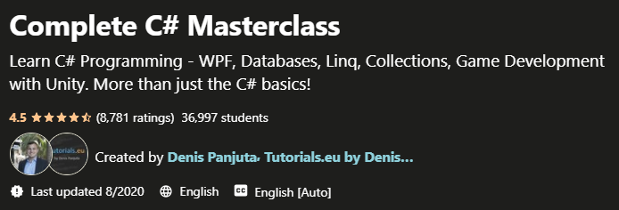

# Complete C# Masterclass
Course: (https://www.udemy.com/course/complete-csharp-masterclass/)  
Course length: <b>33 hours</b>

Learn C# Programming - WPF, Databases, Linq, Collections, Game Development with Unity. More than just the C# basics!

### Course Outline:
Section 1: Your First C# Programm And Overview Of Visual Studio &check;  
Section 2: Datatype and Variables &check;  
Section 3: Functions and Methods &check;  
Section 4: Making Decisions &check;  
Section 5: Loops &check;  
Section 6: Object Oriented Programming &check;  
Section 7: Arrays and Lists &check;  
Section 8: Debugging   
Section 9:  Inheritance and More about OOP   
Section 10: Polymorphism + more OOP + TEXT FILES   
Section 11: Advanced C# Topics   

Section 12: Lights Out Game  
Section 13: Forms in React  
Section 14: Forms Exercise  
Section 15: Todo List Project  
Section 16: Building Yahtzee  
Section 17: React Lifecycle Methods  
Section 18: LifeCycle Methods & API Exercise  
Section 19: Building the Dad Jokes App  
Section 20: React Router:  
Section 21: Vending Machine Exercise  

